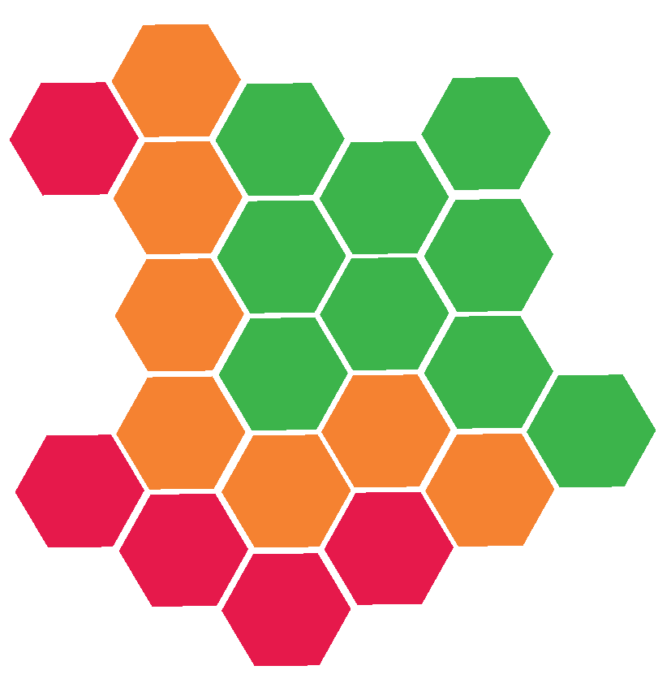

# Final check {#ontcheckchap}
<center>
{style="width:200px; border-radius:15px; border:5px solid white; background:white"}
</center>

After trimming or filtering reads (quality control) it is always important to carry out a quality check. We will therefore run NanoPlot again.

## Final NanoPlot
<center>
{style="width:200px"}
</center>

__Note__: We are using a long informative output directory name. This is important as we may need to rerun `chopper` a few more times with different options until we are happy. 

```{bash eval=FALSE}
#Make an output directory before running NanoPlot
mkdir nanoplot/chopperq10minlen500_porechop
#Run NanoPlot on the fastq file with the filtered and porechopped data
NanoPlot -t 4 \
--fastq chopper/Acinetobacter.chopperq10minlen500.porechop.fastq \
-o nanoplot/chopperq10minlen500_porechop/ -p Acinetobacter_
```

Now inspect the report

```{bash, eval=FALSE}
firefox nanoplot/chopperq10minlen500_porechop/Acinetobacter_NanoPlot-report.html
```

## ONT QC considerations
<center>
{style="width:150px; background:white; border-radius:15px"}
</center>

Ultimately when quality checking we need to take into account how much data we are left with. We need to make sure we have a good amount of bases and reads for our application. However, we also want to make sure we aren\'t left with a lot of poor quality data.

Depending on our application the quality of the reads may be less important, or the other way around. This is the same with the amount of reads and bases. What is needed will be clearer when you know what type of data you have. These considerations will be covered in our future workshops of the specific data types

A quick example is data for a genome assembly. For this type of analysis we will want our number of bases to reach a certain coverage. We\'ll want a decent quality but a high coverage can help overcome lower quality (more on this in a future workshop). Generally for ONT assemblies you will want 20X - 100X coverage with a higher coverage producing a better assembly (100x coverage= 100bp sequencing data per 1bp of the genome size). Higher coverages may be worse as it can be too much information for an assembly algorithm to cope with.

In addition to the amount of bases, the length of reads is also important. One read that is 10kbp long is likely better than 10 reads that are each 1kbp long for a genome assembly. This is because less reads need to be assembled.

## Chopper Reattempts
<center>
{style="width:200px; border-radius:15px; border:5px solid white; background:white"}
</center>

Keeping all this in mind, let's say this sequencing is for a genome with a size of 0.5 Mbp (0.5 million base pairs). We want at least 20X coverage (i.e 10,000,000 total bases). Do we have this for the data that was porechopped and chopper'd?

If not, try running `chopper` with a different choice for `-q` until you do. Then attempt to answer the questions below. These aren't MCQs as you will get different answers based on what value you use for `-q`.

+ What is an option that works to get the desired coverage? 
+ Is the overall quality decent (Mean & Median read quality > 10)?
+ What is the N50 of your QC'd reads?
+ How many extra reads and bases did you retain compared to the Q10 filtering?

Tips:

+ Make sure your new output paths have unique names.
+ Use `NanoPlot` results to compare the Q10 filtering to your own. The `NanoStat` part is especially helpful.

## ONT Recap
<center>
{style="width:200px; border-radius:15px; border:5px solid white; background:white"}
</center>

That is the end of the ONT QC section.

We carried out:

- `NanoStat`: Produced read quality and length stats of our raw reads.
- `Porechop`: Removed adapters from our reads.
- `NanoPlot`: Produced read quality and length stats and plots of our porechopped reads.
- `chopper`: Filtered our porechopped reads based on quality and length.
- Final check: `NanoPlot` of our filtered reads. It is always good to check the quality after every quality control step.