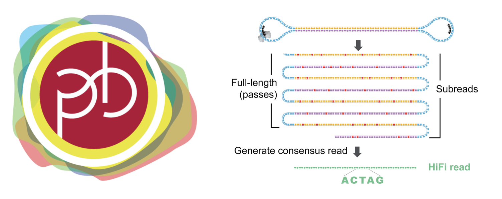

# PacBio QC {#pbqcchap}
<center>
{style="width:600px; border-radius:15px; background:null"}
</center>

We will now look at some quality metrics of our filtered HiFi sequences.

Before carrying out any specific commands first make sure you are in the relevant directory.

```{bash eval=FALSE}
cd ~/QC_workshop/PB_QC/data/hifi
```

## QC the subreads with RabbitQCPlus
<center>
{style="width:500px; border-radius:15px; background:null"}
</center>

`RabbitQCPlus` generates QC information using a fastq file as input.

Let's run `RabbitQC` on our filtered HiFi data:
```{bash eval=FALSE}
RabbitQCPlus -i ERR13246467_qc.filt.fastq.gz -w 1 –TGS
```

__Parameters__:

- `-i` to specify the input fastq file name
- `-w` to specify the number of threads
- `--TGS` to specifiy the data is Third Generation Sequencing data (ONT or PB)

View the output using `firefox`.

```{bash eval=FALSE}
firefox ERR13246467_qc_RabbitQCPlus.html
```

The \"Reads Length Distribution\" shows ....

The other plots show the % nucleotide frequencies (AGCT) and mean quality scores for the beginning and end of the reads. 

The mean quality plots unfortunately do not show anything because ... 

The main advantage of `RabbitQC` is that it is a very fast way to assess the processed read lengths.

## Final summary
<center>
{style="width:150px; background: white; border-radius:5px"}
</center>

That is the end of this book. You have learnt how to QC ONT & PacBio data. Of course there are various other tools out there and the field is always advancing so we suggest you also have a look what is out there.

Thanks for reading.
