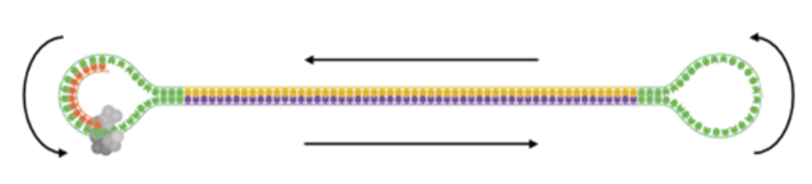
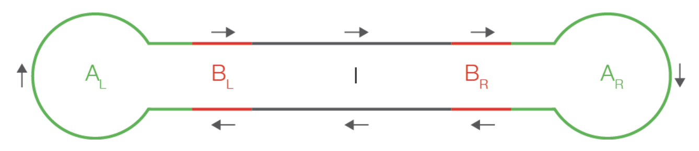
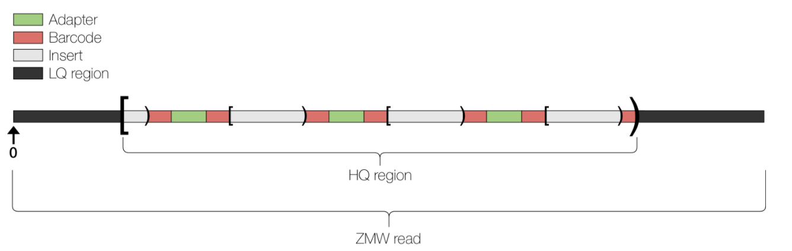
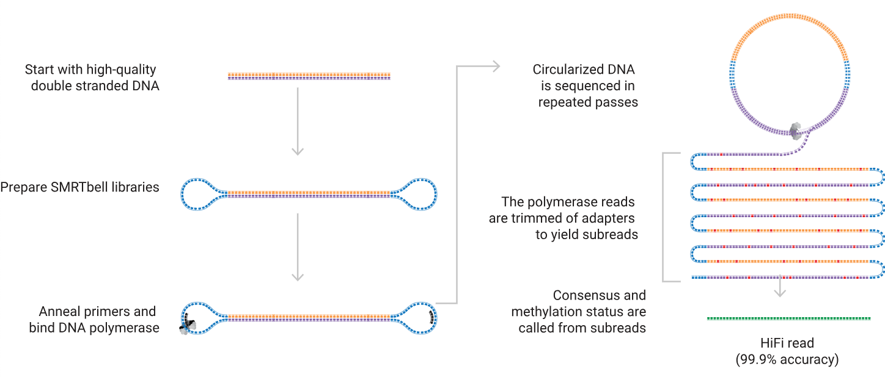
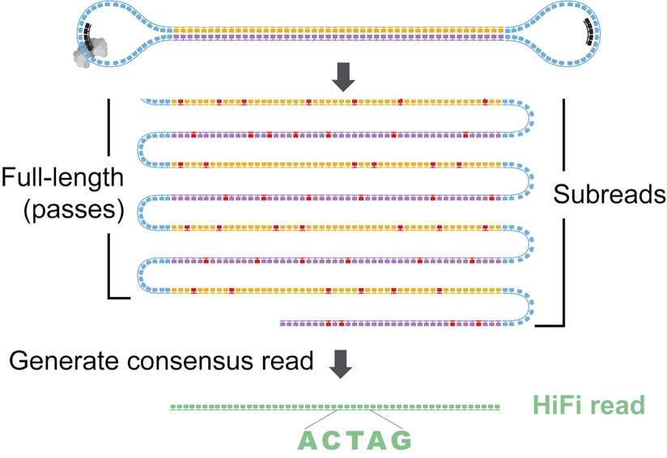

--- 
title: "Long read Quality Control"
author: "Matthew R. Gemmell, Helen Hipperson & Ewan Harney"
date: "`r Sys.Date()`"
site: bookdown::bookdown_site
output: bookdown::gitbook
documentclass: book
bibliography: [book.bib, packages.bib]
biblio-style: apalike
link-citations: yes
favicon: figures/NEOF_favicon.png
description: NEOF book for the Long read quality control workshop
cover-image: "figures/NEOF.png"
---
```{r include=FALSE, cache=FALSE}
library(webexercises)
```

```{r cite-packages, include = FALSE}
# automatically create a bib database for R packages
# add any packages you want to cite here
knitr::write_bib(c(
  .packages(), 'bookdown', 'webexercises'
), 'packages.bib')
```

```{r, echo=FALSE}
#This book uses ionicons icons using the icons package
#https://github.com/mitchelloharawild/icons
#To set this up on your rstudio use the following commands
# install.packages("remotes")
#remotes::install_github("mitchelloharawild/icons")
#download_ionicons()
```

```{r, echo=FALSE}
#Change colour, border, and text of code chunks
#Check style.css for .Rchunk
#https://stackoverflow.com/questions/65627531/change-r-chunk-background-color-in-bookdown-gitbook
#https://bookdown.org/yihui/rmarkdown-cookbook/chunk-styling.html
knitr::opts_chunk$set(class.source="Rchunk") 
```

<center>
{style="width:300px"}
</center>

# Overview
<center>
{style="width:200px"}
</center>

The most popular long read sequencers are produced by ONT and PacBio.
It is beneficial to understand how they work and their error profiles to fully utilise the data they produce.
This course aims to introduce you to ONT and PacBio quality control and checking.

Sessions will start with a brief presentation followed by self-paced computer practicals guided by this online interactive book. This book contains theory, practice code, and exercises. Multiple choice questions will guide the interpretation of results.

At the end of this course learners will be able to:

- Explain how ONT & PacBio sequencing works.
- Understand the advantages and disadvantages of both technologies.
- Quality check ONT data with NanoPlot.
- Remove ONT adaptors with Porechop.
- Filter ONT reads by length and quality with Chopper.
- Filter adapters from PacBio data with HiFiAdapterFilt.
- Convert PacBio BAM files to fastq.
- Quality check PacBio CCS reads with RabbitQCPlus.

## Table of contents {-}

```{r, echo=FALSE, align="centre"}
#Create 2 column dataframe
column_1 <- c(
  #1 Data intro
  '[**Data intro**](#data)', 
 '[{style="height:150px; border-radius:15px; border:5px solid #333333"}](#data)',
 #3 ONT setup
    '[**ONT setup**](#ontsetupchap)', 
 '[{height="150"}](#ontsetupchap)',
 #5 Nanoplot
   '[**NanoPlot**](#nanoplotchap)', 
 '[{height="150"}](#nanoplotchap)',
 #7 ONT final check
   '[**ONT final check**](#ontcheckchap)', 
 '[{style="height:150px; border-radius:15px; border:5px solid #333333; background:white"}](#ontcheckchap)',
  #9 PacBio setup
   '[**PacBio setup**](#pbsetupchap)', 
 '[{style="height:100px; border-radius:15px; border:5px solid #333333"}](#clrsetupchap)',
   #11 PB QC
   '[**PacBio QC**](#pbqcchap)', 
 '[{height="150"}](#clrfiltchap)'
)
column_2 <- c(
  #2 ONT
  '[**ONT background**](#ont)', 
 '[{style="height:150px; border-radius:15px; border:5px solid #333333"}](#ont)',
 #4 porechop
   '[**Porechop**](#porechopchap)', 
 '[{height="100"}](#porechopchap)',
 #6 nanofilt
   '[**Chopper**](#chopper)', 
 '[{height="150"}](#chopper)',
 #8 pb background
   '[**PacBio background**](#pb)', 
 '[{style="height:150px; border-radius:15px; border:5px solid #333333; background:white"}](#pb)',
   #10 PacBio filtering
   '[**PacBio filtering**](#pbfiltchap)', 
 '[{height="150"}](#pbfiltchap)',
  #13 appendix
   '[**Appendix**](#mamba_install)', 
 '[{style="height:150px; border-radius:15px; border:5px solid #333333"}](#mamba_install)'
)
table_df <- data.frame(column_1, column_2)
#Kable and kableextra libraries
library(knitr)
library(kableExtra)
#Create table
#ALign both column in centre (align = "cc")
table_df %>%
  kbl(align= "cc", col.names = NULL) %>%
  kable_styling(position = "center")
```

<a rel="license" href="http://creativecommons.org/licenses/by-nc-sa/4.0/"></a><br />This work is licensed under a <a rel="license" href="http://creativecommons.org/licenses/by-nc-sa/4.0/">Creative Commons Attribution-NonCommercial-ShareAlike 4.0 International License</a>.

<!--chapter:end:01-Long_read_QC.Rmd-->

```{r include=FALSE, cache=FALSE}
library(webexercises)
```
# Data {#data}
<center>
{style="width:200px; border-radius:15px; border:5px solid white; background:null"}
</center>

## The data

The data for today is in the \"QC_workshop\" directory that you copied into your home directory (\"~\") in the Illumina QC day.

Check you have the directory.

```{bash, eval=FALSE}
ls ~
```

If you __do not__ have the \"QC_workshop\" directory, the command to copy it all to your home directory is below.

```{bash eval=FALSE}
cp -r /pub14/tea/nsc206/NEOF/QC_workshop/ ~
```

<!--chapter:end:02-Intro.Rmd-->

```{r include=FALSE, cache=FALSE}
library(webexercises)
```
# (PART\*) ONT {.unnumbered}

# ONT background {#ont}
<center>
{style="width:600px; border-radius:15px; border:5px solid white; background:null"}
</center>

In this section we are going to carry out a quick QC of ONT data using the tool suite NanoPack and the tool Porechop. For this we will use fastq files.

Before carrying out analysis we will cover some background of ONT data. This will include [file formats](#ont_file_formats), & [basecalling](#ont_basecalling).

## File formats {#ont_file_formats}
<center>
{style="width:200px"}
</center>

Although we will only be using fastq files for this tutorial it is important to know the other file formats you may encounter when working with ONT data.

### POD5
<center>
{style="width:150px; border-radius:15px"}
</center>

The POD5 format is the ONT created format to store nanopore DNA data in an easily accessible manner. The files end with the extension `.pod5` and is normally created by the ONT tool `MinKNOW`. It is a collection of [Apache Arrow tables](https://arrow.apache.org/docs/java/table.html) (it is very unlikely you need to understand Apache Arrow tables).

The POD5 file format contains the following information:

- __Reads Table:__ Describes the metadata for each read.
- __Signal Table:__ Contains the signal data from the sequencer.
- __Run Info Table:__ Contains information on the `MinKNOW` runs that created the reads that are in the POD5 file.

The POD5 format is quite new and was released as an early preview in May 2022. Prior to POD5 they used Fast5 files. They changed to POD5 with the following design goals in mind:

- Good write performance for MinKNOW
- Recoverable if the writing process crashes
- Good read performance for downstream tools, including basecall model generation
- Efficient use of space
- Straightforward to implement and maintain
- Extensibility

POD5 links:

- [Main POD5 github page](https://github.com/nanoporetech/pod5-file-format)
- [POD5 File Format Design Details](https://github.com/nanoporetech/pod5-file-format/blob/master/docs/DESIGN.md)
- [POD5 Format Specification](https://github.com/nanoporetech/pod5-file-format/blob/master/docs/SPECIFICATION.md)
- [POD5 Tools commands](https://github.com/nanoporetech/pod5-file-format/blob/master/python/pod5/README.md#tools)

### Fast5
<center>
{style="width:150px"}
</center>

The Fast5 format was the previous format used to store raw data from ONT machine. It is now a legacy format. However, if you use older data for your research you may encounter it.

The format contains the signal data from the pore which can be processed into more useful files.

Fast5 files can contain:

+ Raw signal data
+ Run metadata
+ fastq-basecalls
+ Other additional analyses

The Fast5 file format is an implementation of the HDF5 file format specifically for ONT sequencing data. For more information on Fast5 and a tool to interface with these types of file please see:
https://github.com/nanoporetech/ont_fast5_api

You can convert a Fast5 file to a Pod5 file with the pod5 tools command [`pod5 convert fast5`](https://github.com/nanoporetech/pod5-file-format/blob/master/python/pod5/README.md#pod5-convert-fast5)

### Summary file

The MinION and GridION output a single sequencing summary file in addition to the POD5/Fast5 files. This file contains metdata which describes each sequenced read.

We will not use POD5, Fast5 or summary files for this tutorial as they are not needed most of the time. It is likely these files will not be initially provided to you by a sequencing service as they are very large. However, if you do require them you can always ask but be careful with how long the sequencing centre will retain your data.

### BAM file
<center>
{style="width:100px"}
</center>

__BAM__ files (`.bam`) are the binary version of __SAM__ files (`.sam`).

- __SAM__ stands for "Sequence Alignment/Map" (the B in __BAM__ is Binary).
- __SAM__ files are tab delimited and contain alignment information. 
- __BAM__ files are not human readable whilst __SAM__ files are.
- __SAM__ files are larger than __BAM__.

Generally programs that can work on __SAM__ files can also work on __BAM__ files. Due to the size difference it is preferable to store data in __BAM__ format over __SAM__. Even though a BAM file is smaller than its matching __SAM__ file, __BAM__ files are still very large and can be >100GB.

It can be useful to contain unaligned reads from sequencing machines (e.g\. PacBio and ONT) in __BAM__ files as they can contain more metadata in the header and per-record auxiliary tags compared to __fastq__ files. 

If you are working with __SAM__/__BAM__ files the following link will prove useful: 
https://www.htslib.org/

For more information on the __SAM__ and __BAM__ format please see: 
https://samtools.github.io/hts-specs/SAMv1.pdf


### fastq file
<center>
{style="width:150px"}
</center>

The __fastq__ file format is very consistent and so there is no real difference between __fastq__ files for Illumina, PacBio, and ONT data.

All __fastq__ files will contain a number of lines divisible by 4. This is because each entry/sequence will take up four lines consisting of the following information:

1. Header for __fastq__ entry known as the __fastq header__. 
    + This always begins with a __\'@\'__
    + This is where you might see the most difference between different data. Different machines and different public databases will use different formats for __fastq__ headers.
2. Sequence content
3. Quality header 
    + Always begins with a \'+\'. Sometimes also contains the same information as __fastq__ header.  
4. Quality
    + Each base in the 2nd line will have a corresponding quality value in this line.
    + Note this uses Phred encoding, of which there are different formats. Most, if not all, new files will use Phred+33 but be careful if you are using older data as it may use a different one. See the \"Encoding\" section in the following link for more info: https://en.wikipedia.org/wiki/FASTQ_format.
    +  NOTE: __\'@\'__ can be used as a quality value.

An example of the information of one sequence/entry is:

__\@Sequence 1__  
__CTGTTAAATACCGACTTGCGTCAGGTGCGTGAACAACTGGGCCGCTTT__  
__+__  
__=<<<=>\@\@\@ACDCBCDAC\@BAA\@BA\@BBCBBDA\@BB\@>CD\@A\@B?B\@\@__

## Basecalling {#ont_basecalling}
<center>
{style="width:200px"}
</center>

In short, basecalling is the converting of ONT signals to bases and quality. This step converts the __POD5/Fast5__ files to __BAM__ and/or __fastq__ files.

There are many tools to carry out basecalling with ONT data. ONT sequencing machines carry this out with in built programs. However, if you are interested in the tools used for this the primary ones are MinKNOW, Guppy, Dorado, and Albacore. Unfortunately it is quite hard to find information about these tools unless you own an ONT machine.

We will not go into any more detail about basecalling as this is normally carried out by the machine/sequencing centre. Instead please find some useful links below if you would like to know more.

- MinKNOW
  - [Overview on working with MinKNOW](https://community.nanoporetech.com/docs/prepare/library_prep_protocols/experiment-companion-minknow/v/mke_1013_v1_revde_11apr2016)
  - [Basecalling algorithms](https://community.nanoporetech.com/technical_documents/data-analysis/v/datd_5000_v1_revt_22aug2016/basecalling-algorithms)
- Guppy
  - [Basecalling with Guppy tutorials](https://denbi-nanopore-training-course.readthedocs.io/en/latest/basecalling/index.html)
  - [Input and output files](https://community.nanoporetech.com/docs/prepare/library_prep_protocols/Guppy-protocol/v/gpb_2003_v1_revax_14dec2018/input-and-output-files)
- Dorado
  - [Github page](https://github.com/nanoporetech/dorado)
- Literature
  - [Comprehensive benchmark and architectural analysis of deep learning models for nanopore sequencing basecalling](https://genomebiology.biomedcentral.com/articles/10.1186/s13059-023-02903-2)

<!--chapter:end:03-ONT_background.Rmd-->

```{r include=FALSE, cache=FALSE}
library(webexercises)
```
# ONT Setup {#ontsetupchap}
<center>
{style="width:200px; border-radius:15px; background:null"}
</center>

We need to initialise the environment to use the programs we need. This needs to be done in each terminal you want to run the commands from this ONT section in. Each terminal will only remember what you have told that terminal.

Run the following command in a new terminal. To open a new terminal window, right click on the main screen, and choose `Terminal`.

```{bash eval=FALSE}
. useontqcv2
```

Before carrying out any more commands we will move into the relevant directory.

```{bash eval=FALSE}
cd ~/QC_workshop/ONT_QC/
```

Look in the directory called data and you will notice there are a few directories. You can see the contents of all these directories with the below command.

```{bash eval=FALSE}
ls data/*
```

Each directory has one fastq file. ONT data likes to be organised with data for one sample being in one directory.

To start we will only use the fastq file within the directory called \"Acinetobacter\". As you may have figured out, this contains ONT sequencing data of an Acinetobacter genome. Specifically the data is a subset of the SRA (Sequence Read Archive) Run: SRR7119550.

<!--chapter:end:04-ONT_setup.Rmd-->

```{r include=FALSE, cache=FALSE}
library(webexercises)
```
# NanoStat
<center>
{style="width:150px"}
</center>

The first step is to acquire stats for the sequences in our fastq file. We will use `NanoStat` (https://github.com/wdecoster/nanostat).

`NanoStat` is one of the many tools contained in the `NanoPack` suite (https://github.com/wdecoster/nanopack). We will also use the tools `NanoPlot` and `NanoFilt` downstream.

## NanoStat: run
<center>
{style="width:150px; background: white; border-radius:15px"}
</center>

We want to have a tidy set of directories at the end of this analysis. It would be an untidy mess if we had all the output files in the current directory. We will therefore be making directories and subdirectories to send our output.

```{bash eval=FALSE}
mkdir nanostats
```

Finally we will now run `NanoStat.` The options used are:

- `-n` : File name/path for the output.
- `-t` : Number of threads the script can use.
- `--fastq` : Input data is in fastq format. Other options that can be used are `--fasta`, `--summary`, and `--bam`.

```{bash eval=FALSE}
NanoStat -n nanostats/Acinetobacter_nanostats.tsv \
-t 4 --fastq ./data/Acinetobacter/Acinetobacter_genome_ONT.fastq
```

When the command has finished you can look at the output text file. In this case we will use the convenient `less` command.

```{bash eval=FALSE}
less nanostats/Acinetobacter_nanostats.tsv
```

## NanoStat: output {#nanostat_output}
<center>
{style="width:150px"}
</center>

The file contains four sections with informative headers. These are:

1. __General summary__
   - A list of general summary metrics.
2. __Number, percentage and megabases of reads above quality cutoffs__
   - Based on the mean quality value of a read.
   - The \">Q10\" line shows the number and % of reads with a mean quality above Q10. It also shows the total amount of megabases these reads contain.
3. __Top 5 highest mean basecall quality scores and their read lengths__
   - Shows the top 5 reads with the highest mean quality scores.
4. __Top 5 longest reads and their mean basecall quality score__
   - Shows the top 5 longest reads.
 
## NanoStat: MCQs
<center>
{style="width:150px; background: white; border-radius:15px; border: 5px white solid"}
</center>

With the output of `NanoStat` and the above info on the output please answer the following Multiple-choice questions.

```{r, echo = FALSE}
opts_p <- c("__9.2__", "__9.5__", answer="__12.3__")
```
1.  What is the mean base quality for the read with the highest mean base quality?`r longmcq(opts_p)`

```{r, echo = FALSE}
opts_p <- c(answer="__9.2__", "__9.5__", "__12.3__")
```
2. What is the mean base quality for the longest read?`r longmcq(opts_p)`

```{r, echo = FALSE}
opts_p <- c("__9.2__", answer="__9.5__", "__12.3__")
```
3. What is the mean read quality for all the data?`r longmcq(opts_p)`

```{r, echo = FALSE}
opts_p <- c(answer="__5,770__", "__6,700.5__", "__25,072__")
```
4. What is the length of the read with the 2nd highest mean quality? `r longmcq(opts_p)`

```{r, echo = FALSE}
opts_p <- c("__5,770__", "__6,700.5__", answer="__25,072__")
```
5.  What is the length of the 3rd longest read? `r longmcq(opts_p)`

```{r, echo = FALSE}
opts_p <- c("__5,770__", answer="__6,700.5__", "__25,072__")
```
6.  What is the median read length of the data? `r longmcq(opts_p)`

```{r, echo = FALSE}
opts_p <- c("__0.0Mb__", "__8.8Mb__", answer="__14.1Mb__")
```
7.  To the nearest 0.1 Megabases (i.e. 100,000 bases), what is the total number of bases of the data? `r longmcq(opts_p)`

```{r, echo = FALSE}
opts_p <- c("__0.0Mb__", answer="__8.8Mb__", "__14.1Mb__")
```
8.  How many Megabases are within reads with a quality cutoff of >Q10?  `r longmcq(opts_p)`

```{r, echo = FALSE}
opts_p <- c(answer="__0.0Mb__", "__8.8Mb__", answer="__14.1Mb__")
```
9. How many Megabases are within reads with a quality cutoff of >Q15? `r longmcq(opts_p)`

```{r, echo = FALSE}
opts_p <- c(answer="__5.3Mb__", "__8.8Mb__", answer="__14.1Mb__")
```
9.  To the nearest 0.1 Megabases (i.e. 100,000 bases), what is the total number of bases within reads with a mean quality of Q10 or less (you will need to do some mental maths)? `r longmcq(opts_p)`

## NanoStat: summary
<center>
{style="width:150px; background: white; border-radius:15px; border: white solid 5px"}
</center>

We have carried out our first step of QC by quality checking the __fastq__ file with `NanoStat`. Overall the data has good quality, for ONT data >Q10 is good. However, there is some poor quality data so quality control will be needed.

<!--chapter:end:05-NanoStat.Rmd-->

```{r include=FALSE, cache=FALSE}
library(webexercises)
```
# Porechop {#porechopchap}
<center>
{style="width:600px; border-radius:15px; border:5px solid white; background:null"}
</center>

`Porechop` is a tool to find and remove adapters from ONT data (https://github.com/rrwick/Porechop). Adapters are artificial sequences essential for sequencing but of no biological value and so you will typically want them removed.

`Porechop` is no longer supported but it still works and is a good tool. Depending on which basecaller was used on your data, adapter removal may have already been carried out. However, it is always best to run `porechop` if you are not sure. 

`Porechop` has a list of known adapters it will look for and remove. These contain:

- Ligation kit adapters
- Rapid kit adapters
- PCR kit adapters
- Barcodes
- Native barcoding
- Rapid barcoding

`Porechop` will look for these adapters at the start and end of each read. Then it will look for adapters within the sequence (known as middle adapters to `Porechop`). If it finds a middle adapter it will conclude that the read is chimeric (a recombinant read containing sequences from 2 or more reads) and split the read. Depending on the number of middle adapters the chimeric read may split into 2 or more reads.

## Porechop: run
<center>
{style="width:150px"}
</center>

With all that explanation we will now run `Porechop.` Thankfully the command is relatively straight forward with the options:

- `-t`: Number of threads to be used.
- `-i`: Input path of a fasta file, fastq file, or a directory. If a directory is specified it will be recursively searched for fastq files.
- `-o`: Output path. This will either be a fastq or fasta file name.

```{bash eval=FALSE}
#Create output directory
mkdir porechop
#Run porechop command
porechop -t 4 -i ./data/Acinetobacter/Acinetobacter_genome_ONT.fastq \
-o porechop/Acinetobacter.porechop.fastq
```

`Porechop` will take a while to run. Whilst it is running, look at the screen output to get an idea of what it is doing. When finished, look at the bottom of the printed results.

## Porechop: MCQs
<center>
{style="width:150px"}
</center>

```{r, echo = FALSE}
opts_p <- c("__0__", answer="__1,952__", "__79,015__")
```
1. How many reads had adapters trimmed from their start? `r longmcq(opts_p)`

```{r, echo = FALSE}
opts_p <- c("__0__", "__1,952__", answer="__79,015__")
```
2.  How many bases were removed by adapters being trimmed from the end of reads? `r longmcq(opts_p)`

```{r, echo = FALSE}
opts_p <- c(answer="__0__", "__1,952__", "__79,015__")
```
3. How many reads were split based on middle adapters? `r longmcq(opts_p)`

## Porechop: summary
<center>
{style="width:150px"}
</center>

`Porechop` did its job and removed adapters successfully. The next step is to view the quality of our reads so we can be informed when we filter out poor quality reads and bases.

For more uses of `Porechop` please see the below links:

- https://github.com/rrwick/Porechop#quick-usage-examples
- https://github.com/rrwick/Porechop#full-usage

<!--chapter:end:06-Porechop.Rmd-->

```{r include=FALSE, cache=FALSE}
library(webexercises)
```
# NanoPlot {#nanoplotchap}
<center>
{style="width:200px"}
</center>

`NanoPlot` can be thought of as the `fastqc` for ONT data. It produces a lot of useful visualisations to investigate the quality of ONT sequencing data. It can be used for __fastq__, __fasta__, __BAM__, and sequencing summary files. The link for its github page is: https://github.com/wdecoster/NanoPlot

ONT data has much lower quality scores than Illumina with Q10 being good. If you have enough coverage and length the low quality can be corrected by downstream processes not covered in this tutorial.

## NanoPlot: run
<center>
{style="width:150px"}
</center>

Prior to running `NanoPlot` we will make a directory for the `NanoPlot` output. As `NanoPlot` creates a lot of files, we'll make a subdirectory for the `NanoPlot` output for the porechopped data.

```{bash eval=FALSE}
mkdir nanoplot
mkdir nanoplot/porechop
```

Now to run `NanoPlot`. The options we will use are:

- `-t`: Number of threads to be used.
- `--fastq`: Specifies the input path which is a fastq file.
- `-o`: Directory where the output will be created.
- `-p`: Prefix of output files. It is useful to have "_" at the end of the prefix.

```{bash eval=FALSE}
NanoPlot -t 4 \
--fastq porechop/Acinetobacter.porechop.fastq \
-o nanoplot/porechop -p Acinetobacter_ 
```

## NanoPlot: output
<center>
{style="width:150px"}
</center>

List the files in the output directory.

```{bash, eval=FALSE}
ls nanoplot/porechop/
```

There are quite a few files. These should all start with \"Acinetobacter_\" thanks to the `-p` option. To quickly check all the results we can open the report html file with firefox.

```{bash eval=FALSE}
firefox nanoplot/porechop/Acinetobacter_NanoPlot-report.html
```

The first section contains [`NanoStat` output](#nanostat_output). Quickly look over this and see how it compares to the `NanoStat` output of the pre-porechopped reads.

`r hide("NanoStat of pre-porechopped reads")`
```{r, echo=FALSE}
#Create dataframe of the nanostat pre-porechopped data
df <- read.csv("files/Acinetobacter_nanostats.tsv", 
               sep = ":",
               check.names=FALSE)
df[,2] <- trimws(df[,2],which="both", whitespace="[ \t\r\n]")
#
colnames(df) <- c("General summary","values")
#Display table with kable
library("knitr")
kable(df)
#Display table with flextable
#https://ardata-fr.github.io/flextable-book/index.html
# library("flextable")
# ft <- flextable(df)
# ft <- autofit(ft)
# ft
```
`r unhide()`

After the __Summary Statistics__ section there is a __Plots__ section. 
These are all plots created by [plotly](https://plotly.com/) meaning they are interactive.
With these plots you can:

  - Make boxes to zoom into a specific area. 
  - Click and drag left or right only to zoom into a specific part of the x axis. 
  - Click and drag up or down only to zoom into a specific part of the y axis. 
  - Click the home icon (
```{r, echo=FALSE}
icons::icon_style(icons::fontawesome("home", style="solid"), background = "white")
```
) on the top right to reset the axes.
  - Hover over a points/bars to see the specific values of it.

The plots are:

- __Weighted Histogram of read lengths__
   - Histogram of \"Number of _bases_\" (y) against \"Read length\" (x).
- __Weighted Histogram of read lengths after log transformation__
   - Histogram of \"Number of _bases_\" (y) against log transformed \"Read length\" (x).
- __Non weighted histogram of read lengths__
   - Histogram of \"Number of _reads_\" (y) against \"Read length\" (x).
- __Non weighted histogram of read lengths after log transformations__
   - Histogram of \"Number of _reads_\" (y) against log transformed \"Read length\" (x).
- __Yield by length__
   - Plot showing the \"Cumulative yield for minimal length\" (y) by \"Read length\" (x).
   - The cumulative yield is measured in Gigabases (billion bases).
   - This plot is useful to know how many bases you would retain if you filtered reads based on read length.
- __Read lengths vs Average read quality plot using dots__
   - Each dot represents a single read.
   - At the top of the plot is a histogram of Number of reads against read lengths.
   - At the right of the plot is a sideways histogram of number of reads against average read quality.
- __Read lengths vs Average read quality kde plot__
   - Each dot represents a single read with a topology map showing the density of plots. The darker the area the more dense.
   - This is the most informative plot.
   - At the top of the plot is a histogram of Number of reads against read lengths.
   - At the right of the plot is a sideways histogram of number of reads against average read quality.

## NanoPlot: MCQs
<center>
{style="width:150px"}
</center>

Please attempt the below MCQs with the information in the report html.

```{r, echo = FALSE}
opts_p <- c(answer="__9.5__", "__6,962.1__", "__8.8Mb__")
```
1. What is the mean read quality for all the data?`r longmcq(opts_p)`

```{r, echo = FALSE}
opts_p <- c("__9.5__", answer="__6,962.1__", "__8.8Mb__")
```
2.  What is the mean read length of the data? `r longmcq(opts_p)`

```{r, echo = FALSE}
opts_p <- c("__9.5__", "__6,962.1__", answer="__8.8Mb__")
```
3.  How many Megabases are within reads with a quality cutoff of >Q10?  `r longmcq(opts_p)`

```{r, echo = FALSE}
opts_p <- c("__10Mb (0.01Gb)__", "__146Mb (0.146Gb)__", answer="__4Mb (0.004Gb)__")
```
4. Approximately how many bases would you retain if you filtered out/removed reads with a length <10,000bp (Yield by length)? `r longmcq(opts_p)`

```{r, echo = FALSE}
opts_p <- c("__6-8__", "__8-10__", answer="__10-12__")
```
5. Look at the Read lengths vs Average read quality plots. In what average quality range are the majority of reads? `r longmcq(opts_p)`

## NanoPlot: summary
<center>
{style="width:150px"}
</center>

We have used `NanoPlot` to produce read quality and length stats in table and plot form. Our data still looks good after porechopping but we still need to carry out some filtering.

You can use `NanoPlot` with different input files. This will give you different plots. For more details please see the \"Plots Generated\" section on: https://github.com/wdecoster/NanoPlot.

<!--chapter:end:07-NanoPlot.Rmd-->

```{r include=FALSE, cache=FALSE}
library(webexercises)
```
# Chopper {#chopper}
<center>
{style="width:150px"}
</center>

`Chopper` can be used to remove/filter reads by quality and/or read length (https://github.com/wdecoster/chopper). This is very useful as you will most likely want long and good quality reads for downstream processes, such as genome assemblies.

`Chopper` also removes any reads that map to the lambda phage genome. 
The lambda phage genome is used for DNA Control experiments for ONT sequencers ([ONT DNA Control Experiment overview](https://community.nanoporetech.com/nanopore_learning/lessons/dna-control-experiment)).

It is always important to know what your data is and if your planned filtering and trimming is appropriate. For example, you may be working with amplicon data where the read lengths will vary between 500bp and 750bp. In that case it is useful to set a min length of 500 and a maxlength of 750.

This data is from a genome so wanting long and high quality reads is appropriate. Overall the quality of our data looks good. The main exception is the low amount of sequencing/coverage. The low coverage is because it is a subset of the whole data for workshop purposes (the full dataset would take too long to run here). There are some shorter length and lower quality reads which we will remove.

## Chopper: run
<center>
{style="width:150px"}
</center>

First we will create an output directory.
```{bash eval=FALSE}
mkdir chopper
```

We will filter out sequences that are shorter than 500bp (`-l 500bp`) and filter out sequences with a average read quality less than Q10 (`-q 10`). We have chosen these values as they are a good default for genomic data. Q10 appeared to be a good choice from `NanoPlot` as the majority of reads had a quality of >Q10.

```{bash eval=FALSE}
chopper -q 10 -l 500 \
-i porechop/Acinetobacter.porechop.fastq > \
chopper/Acinetobacter.chopperq10minlen500.porechop.fastq
```

Are the chosen options appropriate? Let\'s find out.

<!--chapter:end:08-Chopper.Rmd-->

```{r include=FALSE, cache=FALSE}
library(webexercises)
```
# Final check {#ontcheckchap}
<center>
{style="width:200px; border-radius:15px; border:5px solid white; background:white"}
</center>

After trimming or filtering reads (quality control) it is always important to carry out a quality check. We will therefore run NanoPlot again.

## Final NanoPlot
<center>
{style="width:200px"}
</center>

__Note__: We are using a long informative output directory name. This is important as we may need to rerun `chopper` a few more times with different options until we are happy. 

```{bash eval=FALSE}
#Make an output directory before running NanoPlot
mkdir nanoplot/chopperq10minlen500_porechop
#Run NanoPlot on the fastq file with the filtered and porechopped data
NanoPlot -t 4 \
--fastq chopper/Acinetobacter.chopperq10minlen500.porechop.fastq \
-o nanoplot/chopperq10minlen500_porechop/ -p Acinetobacter_
```

Now inspect the report

```{bash, eval=FALSE}
firefox nanoplot/chopperq10minlen500_porechop/Acinetobacter_NanoPlot-report.html
```

## ONT QC considerations
<center>
{style="width:150px; background:white; border-radius:15px"}
</center>

Ultimately when quality checking we need to take into account how much data we are left with. We need to make sure we have a good amount of bases and reads for our application. However, we also want to make sure we aren\'t left with a lot of poor quality data.

Depending on our application the quality of the reads may be less important, or the other way around. This is the same with the amount of reads and bases. What is needed will be clearer when you know what type of data you have. These considerations will be covered in our future workshops of the specific data types

A quick example is data for a genome assembly. For this type of analysis we will want our number of bases to reach a certain coverage. We\'ll want a decent quality but a high coverage can help overcome lower quality (more on this in a future workshop). Generally for ONT assemblies you will want 20X - 100X coverage with a higher coverage producing a better assembly (100x coverage= 100bp sequencing data per 1bp of the genome size). Higher coverages may be worse as it can be too much information for an assembly algorithm to cope with.

In addition to the amount of bases, the length of reads is also important. One read that is 10kbp long is likely better than 10 reads that are each 1kbp long for a genome assembly. This is because less reads need to be assembled.

## Chopper Reattempts
<center>
{style="width:200px; border-radius:15px; border:5px solid white; background:white"}
</center>

Keeping all this in mind, let's say this sequencing is for a genome with a size of 0.5 Mbp (0.5 million base pairs). We want at least 20X coverage (i.e 10,000,000 total bases). Do we have this for the data that was porechopped and chopper'd?

If not, try running `chopper` with a different choice for `-q` until you do. Then attempt to answer the questions below. These aren't MCQs as you will get different answers based on what value you use for `-q`.

+ What is an option that works to get the desired coverage? 
+ Is the overall quality decent (Mean & Median read quality > 10)?
+ What is the N50 of your QC'd reads?
+ How many extra reads and bases did you retain compared to the Q10 filtering?

Tips:

+ Make sure your new output paths have unique names.
+ Use `NanoPlot` results to compare the Q10 filtering to your own. The `NanoStat` part is especially helpful.

## ONT Recap
<center>
{style="width:200px; border-radius:15px; border:5px solid white; background:white"}
</center>

That is the end of the ONT QC section.

We carried out:

- `NanoStat`: Produced read quality and length stats of our raw reads.
- `Porechop`: Removed adapters from our reads.
- `NanoPlot`: Produced read quality and length stats and plots of our porechopped reads.
- `chopper`: Filtered our porechopped reads based on quality and length.
- Final check: `NanoPlot` of our filtered reads. It is always good to check the quality after every quality control step.

<!--chapter:end:09-ONT_final_check.Rmd-->

```{r include=FALSE, cache=FALSE}
library(webexercises)
```
# (PART\*) PacBio {.unnumbered}

# PacBio Background {#pb}
<center>
{style="width:400px; border-radius:15px; background:white"}
</center>

In this section we will convert PacBio sequencing data (BAM files) into fastq files, filter out any adapter sequences and generate quality control plots and statistics.

## File formats
<center>
{style="width:150px"}
</center>

Sequence data from PacBio are output as subreads in unaligned BAM format. (Further explanation of the BAM format is in section 3.1.4).

The figure below shows a schematic of a circular DNA molecule of a PacBio library with the colours representing:

- Black, I = Insert DNA, i.e\. the double-stranded DNA of your sample
- Red, B = Barcodes, optional single (Left or Right) or double (Left & Right) for multiplexing samples
- Green, A = Adapter, SMRTbell adapters with a double-stranded stem and single-stranded hairpin loop.

<center>
{style="width:900px; border-radius:15px; background:null"}
</center>

Sequencing follows the direction of the arrows and continues around until either the end of the sequencing run or if the DNA polymerase fails.

PacBio sequencing takes place in Zero-Mode Waveguides (ZMWs) on a sequencing cell. These are tiny holes where a DNA polymerase binds a single molecule of DNA for sequencing, and each DNA base is detected when a labelled nucleotide is incorporated and fluoresces when excited by light.

A ZMW read consists of the data collected from a single ZMW, with the HQ (high quality) region recorded when just a single molecule of DNA is present in the ZMW.

<center>
{style="width:900px; border-radius:15px; background:null"}
</center>

This schematic shows the structure of a ZMW read in linear format. Insert DNA subreads are interspersed with the barcode and adapter sequence of the SMRTbell library.
For more information see: https://pacbiofileformats.readthedocs.io/en/13.0/Primer.html


## HiFi reads

The ZMW reads are processed on the sequencing instrument to produce HiFi reads, using the circular consensus (CCS) tool. CCS generates high accuracy sequences from a consensus of many subreads (i.e\. there would be several of the grey insert regions shown above in every ZMW read). By taking the consensus sequences HiFi reads have an accuracy of Q≥20 (99%). In the diagram below the insert region is shown by purple and yellow lines representing the sequences obtained by each strand of the template DNA, sequencing errors by the red bases, and the green line represents the high-accuracy consensus read.

<center>
{style="width:800px; border-radius:15px; background:null"}
</center>


For this tutorial we will carry out adapter filtering and quality checking aof a HiFi BAM file.

## Tools
<center>
{style="width:200px"}
</center>

### HiFiAdapterFilt

https://github.com/sheinasim/HiFiAdapterFilt

We will use `HiFiAdapterFilt` to remove any reads containing PacBio adapter sequences.

### smrttools

https://www.pacb.com/wp-content/uploads/SMRT-Tools-Reference-Guide-v13.0.pdf

We will also use `smrttools` from PacBio to:

- Generate any missing index files
- Convert BAM to fasta/q format.

### RabbitQCPlus

https://github.com/RabbitBio/RabbitQCPlus

Lastly, we will also use `RabbitQCPlus` to assess the CCS assembled reads in fastq format.

<!--chapter:end:10-PB_background.Rmd-->

```{r include=FALSE, cache=FALSE}
library(webexercises)
```
# PacBio setup {#pbsetupchap}
<center>
{style="width:600px; border-radius:15px; background:null"}
</center>

We need to initialise the environment to use the programs we need. This needs to be done in each terminal you want to run the commands from this PacBio section in. Each terminal will only remember what you have told that terminal.

Run the following command in a new terminal. To open a new terminal window, right click on the main screen, choose `Terminal`.

```{bash eval=FALSE}
. usepbqc
```

Before carrying out any specific commands we will move into the relevant directory.

```{bash eval=FALSE}
cd ~/QC_workshop/PB_QC/data/hifi
```

Use `ls` to list the contents of this directory. You will see that there is a BAM HiFi reads file. [These data](https://www.ebi.ac.uk/ena/browser/view/PRJEB76228) were generated from high molecular weight DNA of the springtail _Orchesella dallaii_ for _de novo_ genome assembly.

## PacBio SMRT tools
PacBio's SMRT tools are a set of software applications for analyzing long-read sequencing data. There are many functions in this toolkit, but we are going to just use a couple: pbindex and bam2fastq.

We will use the SMRT Tools package to first index the BAM file and then convert it to fastq format. The index file is necessary for performing the fastq conversion.

You can do this with the following commands:

```{bash eval=FALSE}
# Index the BAM file containing the hifi reads and 
pbindex ERR13246467_subset.hifi_reads.bam

# Convert the indexed BAM file to fastq format
bam2fastq ERR13246467_subset.hifi_reads.bam -o ERR13246467_qc
```

Use `ls` to list the contents of this directory. Along with the original BAM file you should now see a `.pbi` index file and a `.fastq.gz` compressed fastq file.

<!--chapter:end:11-PB_setup.Rmd-->

```{r include=FALSE, cache=FALSE}
library(webexercises)
```
# PacBio filtering {#pbfiltchap}
<center>
{style="width:150px; background: white; border-radius:5px"}
</center>

PacBio HiFi reads are generated via CCS analysis which computes a consensus sequence from multiple passes of the circularised SMRTbell molecules. Each 'pass' will be interspersed with an adapter sequence (as shown in 10.1). Whilst the majority of these adapter sequences are removed by the CCS analysis that generates the HiFi BAM file, it is good practice to check for any remaining sequences to ensure they are removed before downstream analysis.

We will perform this using the software [HiFiAdapterFilt](https://bmcgenomics.biomedcentral.com/articles/10.1186/s12864-022-08375-1). 

This software has already been installed, but we will start by setting the PATH variable

## $PATH

The PATH environment variable is a list of directories that an operating system searches to find executable files and commands (programs). If a directory is included in the `$PATH`, it won’t be necessary to type out the full name of the executable when running a command. Directories can be added to the path on a temporary basis using the export command, but if you close your terminal or start a new session you will have to rerun the export command.

```{bash eval=FALSE}
# Add the hifiadapterfilt script and the database to your path

export PATH=$PATH:/pub14/tea/nsc206/git_installs/HiFiAdapterFilt

export PATH=$PATH:/pub14/tea/nsc206/git_installs/HiFiAdapterFilt/DB
```

The echo command displays text on the screen, and we can use it to show the contents of the `$PATH` environment variable now that we have exported the locations of hifiadapterfilt and hifiadapterfilt/db.

```{bash eval=FALSE}
# Check the PATH environment variable with echo

echo $PATH
```

Great, now we can proceed to adapter filtering.

## HiFiAdapterFilt

<center>
{style="width:150px; background: white; border-radius:5px"}
</center>

[HiFiAdapterFilt](https://github.com/sheinasim/HiFiAdapterFilt) blasts the reads against a database of PacBio adapter sequences and excludes reads if the match with an adapter is good enough (the default is a blast percent identity match of 97% and a minimum length of 44 bp). It creates a file with the suffix ‘.filt.fastq.gz’ with the adapters removed that can be used for QC and downstream analysis.

Run HiFiAdapterFilt on the fastq file:

```{bash eval=FALSE}
hifiadapterfilt.sh -p ERR13246467_qc
```

The `-p` parameter sets the prefix of the file to be filtered.

Use `less` to inspect the results to check for adapter contamination:

```{bash eval=FALSE}
less ERR13246467_qc.stats
```

```{r, echo = FALSE}
opts_p <- c("__99.99%__", "__2__", answer="__13798__")
```
How many CCS reads are in the unfiltered dataset?  `r longmcq(opts_p)`

```{r, echo = FALSE}
opts_p <- c("__99.99%__", answer="__2__", "__13798__")
```
How many adapter contaminated reads were found?  `r longmcq(opts_p)`

```{r, echo = FALSE}
opts_p <- c(answer="__99.99%__", "__2__", "__13798__")
```
What percentage of CCS reads are retained (i.e. unfiltered)?  `r longmcq(opts_p)`

Very few reads were found to contain adapter sequences. This isn't entirely unexpected as the CCS algorithm on the instrument will filter out most of them. However, the authors of HiFiAdapterFilt found that >95% of published HiFi datasets did contain some adapter sequences, so it is worthwile to check and remove these.

## PacBio adapter filtering: summary
<center>
{style="width:150px; background: white; border-radius:5px; border: white solid 5px"}
</center>

We have now filtered any remaning sequencing adapters from our HiFi data. Next we will learn how to QC the data.

<!--chapter:end:12-PB_filtering.Rmd-->

```{r include=FALSE, cache=FALSE}
library(webexercises)
```
# PacBio QC {#pbqcchap}
<center>
{style="width:600px; border-radius:15px; background:null"}
</center>

We will now look at some quality metrics of our filtered HiFi sequences.

Before carrying out any specific commands first make sure you are in the relevant directory.

```{bash eval=FALSE}
cd ~/QC_workshop/PB_QC/data/hifi
```

## QC the subreads with RabbitQCPlus
<center>
{style="width:500px; border-radius:15px; background:null"}
</center>

`RabbitQCPlus` generates QC information using a fastq file as input.

Let's run `RabbitQC` on our filtered HiFi data:
```{bash eval=FALSE}
RabbitQCPlus -i ERR13246467_qc.filt.fastq.gz -w 1 --TGS
```

__Parameters__:

- `-i` to specify the input fastq file name
- `-w` to specify the number of threads
- `--TGS` to specifiy the data is Third Generation Sequencing data (ONT or PB)

View the output using `firefox`.

```{bash eval=FALSE}
firefox ERR13246467_qc.filt_RabbitQCPlus.html
```

At the top of the html file are some summary tables followed by a histogram showing the distribution of read lengths in the fastq file (with a bin width of 10). You can zoom in on parts of the histogram by dragging the arrows along the bars at the bottom and to the right of the plot.

```{r, echo = FALSE}
opts_p <- c("__7370__", answer="__10540__", "__11300__")
```
Which bin contains the greatest number of reads?  `r longmcq(opts_p)`

Underneath the plot showing the distribution of read lengths are two quality plots showing the phred quality of head and tail bases (the first and last 100 bases in a read).

Strangely these plots appear to be empty. However, try ‘mousing over’ the empty plot. What do you see? Does this give an idea as to why the plots might be empty? When you think you might have an answer, click on the button below:

`r hide("Why are the RabbitQCPlus plots empty?")`
Quality scores for PacBio [fastq](https://en.wikipedia.org/wiki/FASTQ_format) files follow the sanger convention, running from 0 and 93 (ASCII 33-126). Unfortunately, the output of RabbitQCPlus plots a figure where the y-axis is limited to display between 0 and 42. While this is fine for Illumina data, it means that we don’t see any results in the plots for PacBio data. Mousing over the plot can reveal the quality scores at each position. You should see that quality scores are mostly in the range of 83-86. 
`r unhide()`

One solution to this problem is to use an alternative program to inspect quality. In [Chapter 4](https://neof-workshops.github.io/QC_91wlgv/Illumina/04-Good_quality_data.html) of the Illumina QC bookdown you used a program called fastqc to inspect the quality of Illumina data. How might you use fastqc to inspect the quality of this PacBio hifi file? Have a go at this before checking the answer below.


`r hide("Inspecting PacBio data quality with fastqc")`
```{r, eval=FALSE}
#Open a new terminal and activate the illuminaqc environment
. useilluminaqc
#Navigate to the directory containing the hifi fastq file
cd QC_workshop/PB_QC/data/hifi
#Create an output directory for the fastqc file
mkdir fastqc_output
#Run fastqc
fastqc -o fastqc_output/ ERR13246467_qc.filt.fastq.gz
#View the file with firefox
firefox fastqc_output/ERR13246467_qc.filt.fastqc.html
```
`r unhide()`

You should now be able to view the fastqc quality plots for the PacBio hifi fastq file. RabbitQCPlus is considerably quicker and more efficient than fastqc at generating plots, which can be very useful when dealing with many and/or large files. If you want to do a quick inspection of summary tables, read length distribution and GC content, and don’t mind ‘mousing-over’ the quality plots, RabbitQCPlus is a useful tool. But if you want a more detailed visual output, consider using fastqc (either on the complete file, or on a subset of reads).

## Final summary
<center>
{style="width:150px; background: white; border-radius:5px"}
</center>

That is the end of this book. You have learnt how to QC ONT & PacBio data. Of course there are various other tools out there and the field is always advancing so we suggest you also have a look what is out there.

Thanks for reading.

<!--chapter:end:13-PB_QC.Rmd-->

```{r include=FALSE, cache=FALSE}
library(webexercises)
```
# (APPENDIX) Appendix {-}

# Further resources
<center>
{style="width:200px; background: white; border-radius:50px"}
</center>

- [Long read tools](https://long-read-tools.org/index.html)

## ONT

Unfortunately with ONT you need an account to access a lot of the content on its website.

- [Nanopack overview](https://github.com/wdecoster/nanopack)
- [ONT website](https://nanoporetech.com/)

## PacBio

- [PacBio website](https://www.pacb.com/)
- [PacBio HiFi sequencing](https://www.pacb.com/technology/hifi-sequencing/)
- [PacBio HiFI reads brochure](https://www.pacb.com/wp-content/uploads/Application-Brochure-HiFi-Reads-for-Highly-Accurate-Long-read-Sequencing.pdf)
- [Sequel II and IIe data files](https://www.pacb.com/wp-content/uploads/Sequel_II_and_IIe_Data_Files.pdf)
- [Revio brochure](https://www.pacb.com/wp-content/uploads/Revio-brochure.pdf)

# Mamba installs {#mamba_install}
<center>
{style="width:200px; border-radius:15px; background:null"}
</center>

## Mamba installation {#mamba_install}

Mamba is a reimplementation of conda. It is a great tool for installing bioinformatic packages including R packages.

Mamba github: <https://github.com/mamba-org/mamba>

The best way to use Mamba is to install Miniforge. It has both Conda and Mamba commands.

Miniforge installation: <https://github.com/conda-forge/miniforge>

Mamba guide: <https://mamba.readthedocs.io/en/latest/user_guide/mamba.html>

## ONT QC environment
To create the mamba environment `ont_qc` run the below commands in your bash. You will need to have `mamba` installed first.

```{bash, eval=FALSE}
#Oxford Nanopore QC
mamba create -n ont_qc
mamba activate ont_qc
#Install tools
mamba install -c bioconda porechop nanoplot chopper nanostat
```

## PB QC environment
To create the mamba environment `pb_qc` run the below commands in your bash. You will need to have `mamba` installed first.

```{bash, eval=FALSE}
#PacBio QC
mamba create -n pb_qc
mamba activate pb_qc
#Install smrttools
mamba install -c hcc smrtlink-tools
#Install git & make for below installs
mamba install -c anaconda git
mamba install -c anaconda make
#R needed for Sequeltools
mamba install -c conda-forge r-base
```

Install [HiFiAdapterFilt](https://github.com/sheinasim/HiFiAdapterFilt) and [RabbitQCPlus](https://github.com/RabbitBio/RabbitQCPlus) via `git`.
I suggest creating a directory called "git_installs" in your home directory and running this code there.

```{bash, eval=FALSE}
#git_installs directory
mkdir ~/git_installs
cd ~/git_installs
#HiFiAdapterFilt
git clone https://github.com/sheinasim/HiFiAdapterFilt
#RabbitQCPlus
git clone https://github.com/RabbitBio/RabbitQCPlus.git
cd RabbitQCPlus
make -j4
```

To run these programs in your own machines you will need to use the full path of the command files.
If you installed these in your "~/git_installs" examples are below.

```{bash, eval=FALSE}
#hifiadapterfilt.sh help manual
~/git_installs/HiFiAdapterFilt/hifiadapterfilt.sh --help
#RabbitQCPlus help manual
~/git_installs/RabbitQCPlus/RabbitQCPlus --help
```

<!--chapter:end:14-Appendix.Rmd-->

